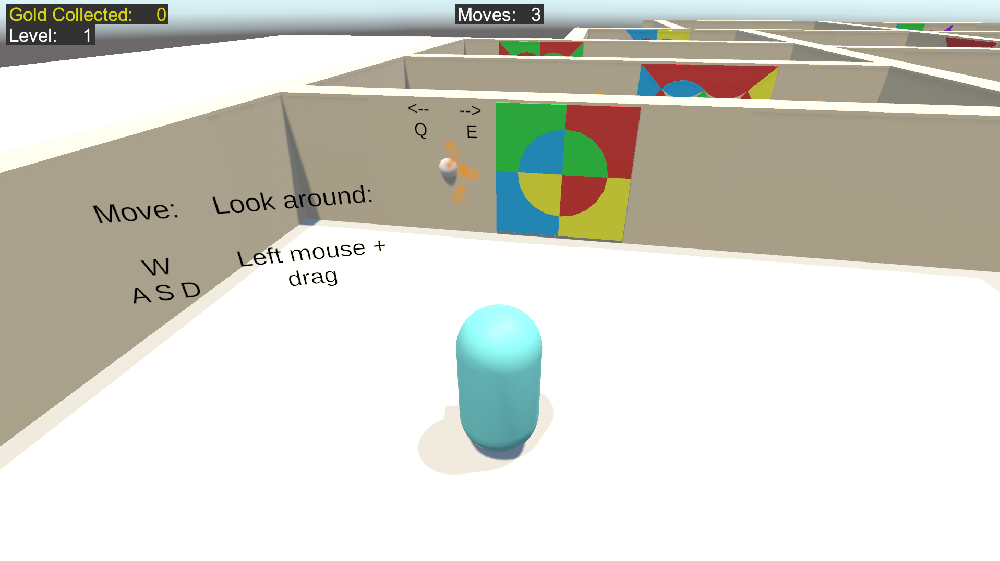
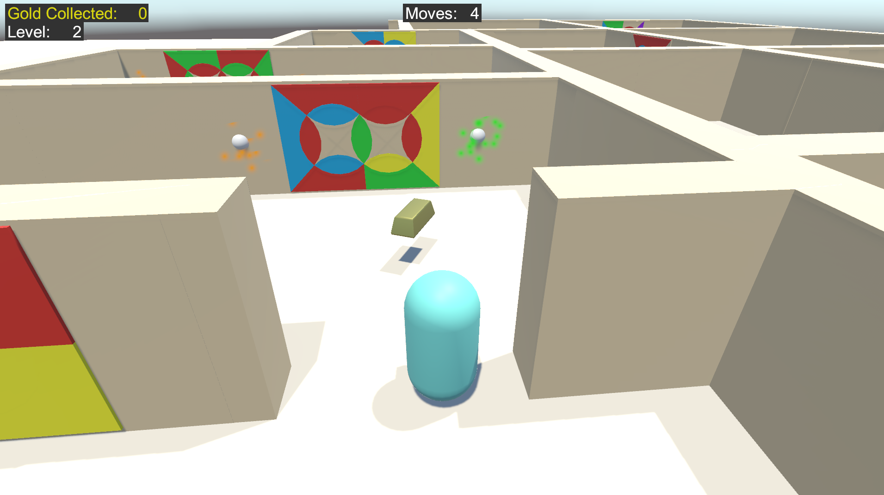
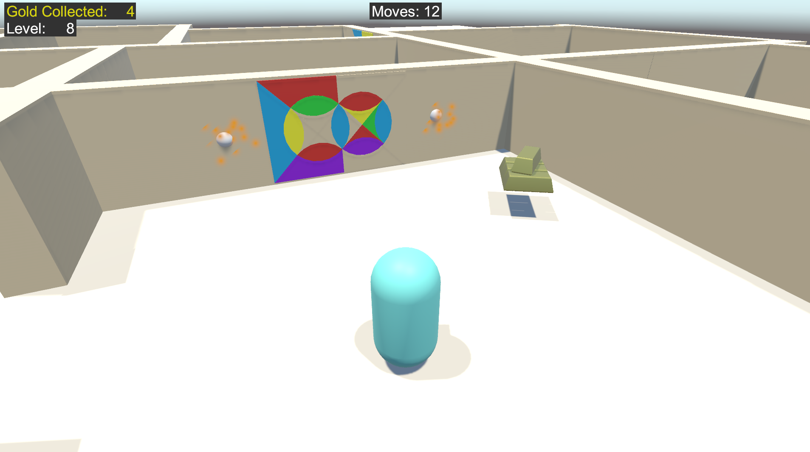

# GM_Unity

This is an assignment for the course Game Mechanics in DAE. 
For this project, we used Unity.

We each got 2 random words as starting point to come up with our mechanics. My words were Tiles & Wheel. I used these to create a puzzle type of game.

The story of the game is about an adventurer who finds a old lost temple and needs to fix the wall paintings to get to the treasure. 
You can solve the puzzles by rotating ("wheel") the circles in the walls to try to match the colors (colored "tiles") with both the colors around it and those inside the circles.
(This project had focus on the mechanics so the art looks quite minimal)

